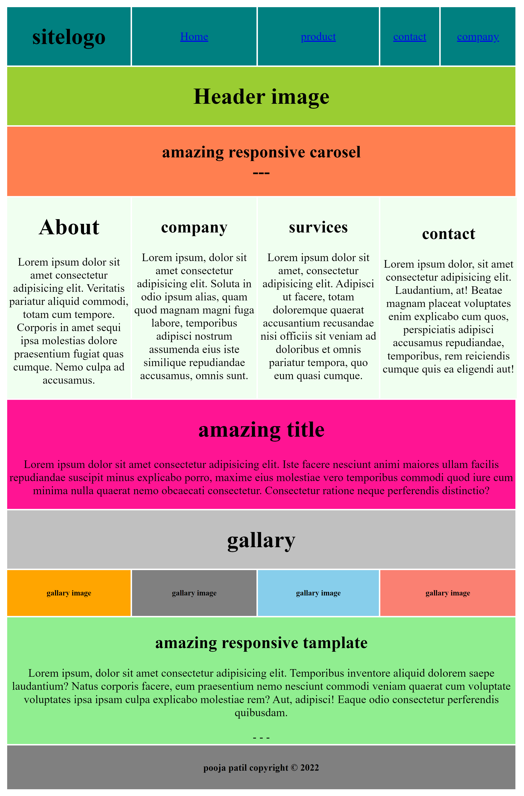
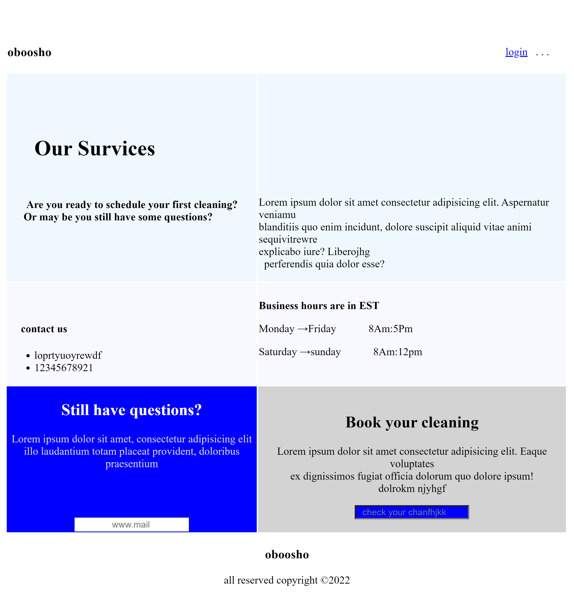
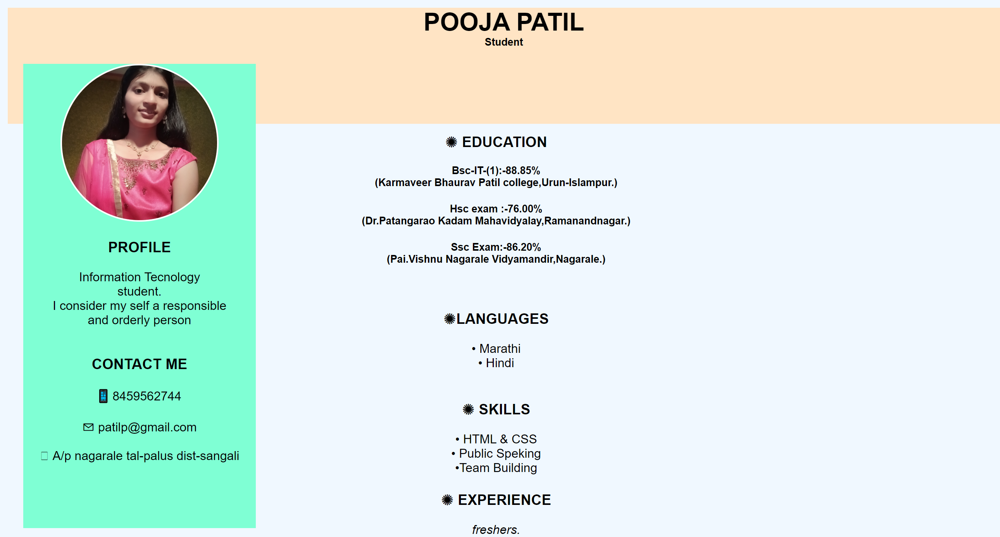
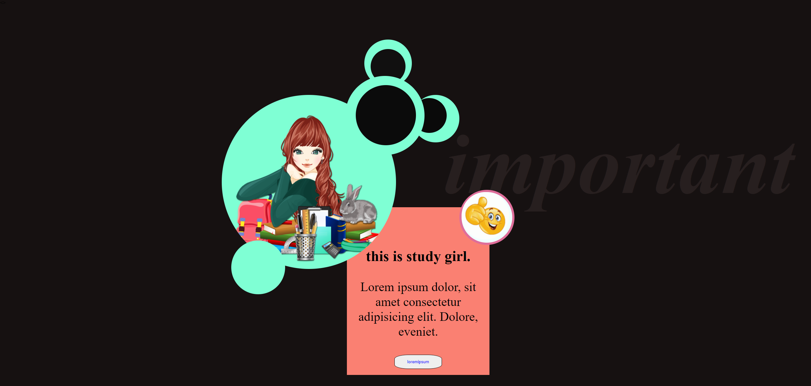
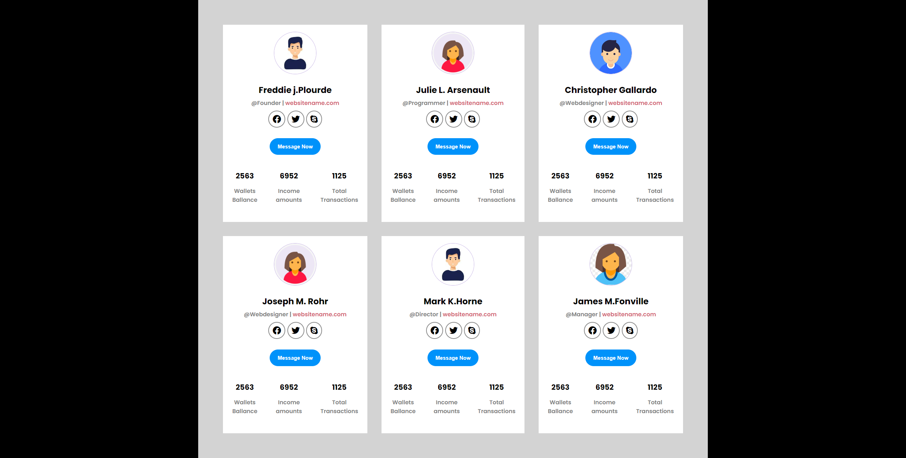

# eHackHow tasks by pooja patil

## task 1

created layout 1 using html table

## task 2

created layout 2 using all html tags

## task 3

my resume

## task 4

## task 5

## task 6

## task 7

