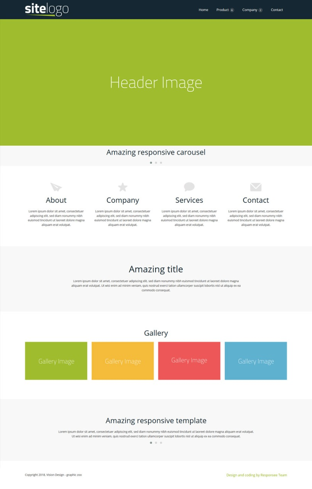

# ehackhow_tasks

> You have to link the templage you download from dribble as well as you'r created output for that perticular template in README.md file

## Task 1

Create a layout given below using html table

## Task 2

Download any template from dribble and create using all html tags

## Task 3

Design your resume using html and css

## Task 4

Recreate your `second task` with the help of html and css

## Task 5

Create card design using html css
